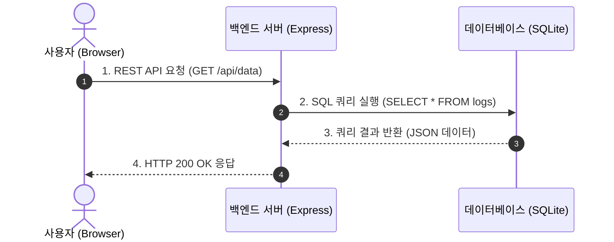
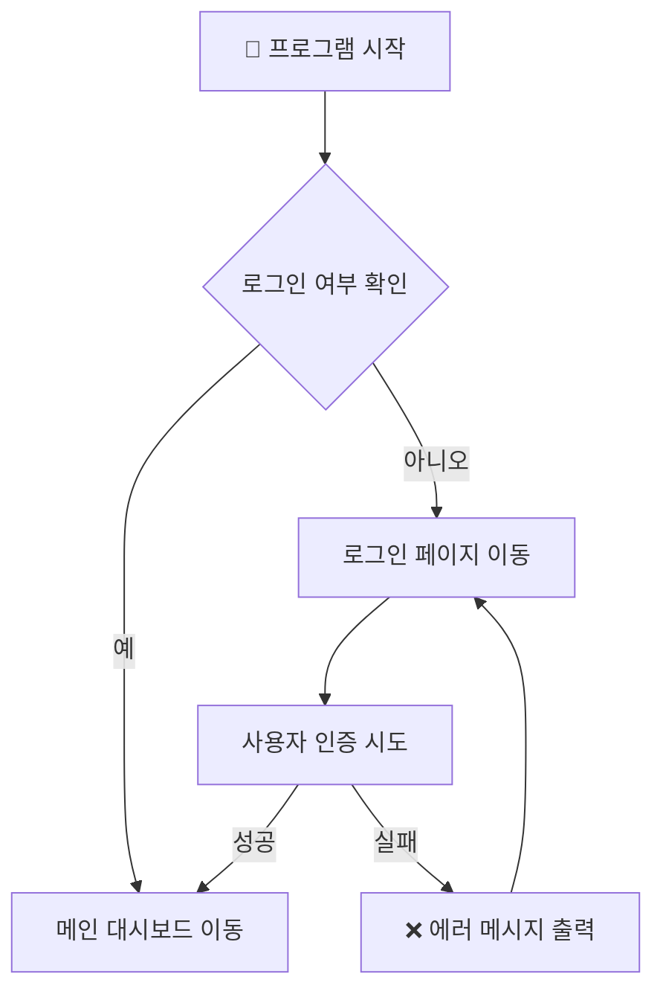

# 📝 핵심 마크다운(Markdown) 문법 & Mermaid 다이어그램 가이드

> **문서 목적**: AI 보고서 작성 및 개발 문서화에 자주 쓰이는 **기본 마크다운 문법**과, 텍스트만으로 정교한 아키텍처 흐름도를 그리는 **Mermaid.js 문법**을 **작성 코드와 실제 미리보기(렌더링)**로 비교하며 한눈에 익히는 요약 가이드입니다.

---

## 📌 1. 기본 마크다운 문법 요약 (작성 코드 🆚 실제 미리보기)

### 1) 제목 (Headers)
`#` 개수로 문서의 위계 구조를 표현합니다.

✍️ **작성 문법 (마크다운 코드):**
```markdown
# 1단계 큰 제목 (H1)
## 2단계 대주제 (H2)
### 3단계 중주제 (H3)
#### 4단계 소주제 (H4)
```

📊 **실제 미리보기 (렌더링 결과):**
> # 1단계 큰 제목 (H1)
> ## 2단계 대주제 (H2)
> ### 3단계 중주제 (H3)
> #### 4단계 소주제 (H4)

---

### 2) 텍스트 서식 (Text Formatting)
글자의 강조, 스타일, 코드를 표현합니다.

✍️ **작성 문법 (마크다운 코드):**
```markdown
**굵은 글씨 (Bold)**
*기울임꼴 (Italic)*
~~취소선 (Strikethrough)~~
`인라인 코드 (Inline Code)`
```

📊 **실제 미리보기 (렌더링 결과):**
- **굵은 글씨 (Bold)**
- *기울임꼴 (Italic)*
- ~~취소선 (Strikethrough)~~
- `인라인 코드 (Inline Code)` ➔ 📖 **[1분 위키: 인라인 코드가 무엇인가요?](wiki/인라인_코드.md)**

---

### 3) 리스트 (Lists)
순서 없는 목록, 순서 있는 목록, 할 일 체크박스를 만듭니다.

✍️ **작성 문법 (마크다운 코드):**
```markdown
- 순서 없는 항목 1
  - 하위 항목 A
  - 하위 항목 B
- 순서 없는 항목 2

1. 순서 있는 항목 1
2. 순서 있는 항목 2

- [x] 완료된 작업 체크박스
- [ ] 미완료 작업 체크박스
```

📊 **실제 미리보기 (렌더링 결과):**
- 순서 없는 항목 1
  - 하위 항목 A
  - 하위 항목 B
- 순서 없는 항목 2

1. 순서 있는 항목 1
2. 순서 있는 항목 2

- [x] 완료된 작업 체크박스
- [ ] 미완료 작업 체크박스

---

### 4) 인용구 & 강조 알림창 (Blockquotes & Alerts)
부연 설명, 강조 사항, 알림 메시지를 표시합니다.

✍️ **작성 문법 (마크다운 코드):**
```markdown
> 일반 인용문입니다. 부연 설명이나 강조할 때 사용합니다.

> [!NOTE]
> 참고할 추가 정보나 백그라운드 지식을 전달합니다.

> [!IMPORTANT]
> 반드시 숙지해야 하는 핵심 요건이나 절차입니다.

> [!WARNING]
> 주의가 필요한 심각한 에러나 주의사항입니다.
```

📊 **실제 미리보기 (렌더링 결과):**
> 일반 인용문입니다. 부연 설명이나 강조할 때 사용합니다.

> [!NOTE]
> 참고할 추가 정보나 백그라운드 지식을 전달합니다.

> [!IMPORTANT]
> 반드시 숙지해야 하는 핵심 요건이나 절차입니다.

> [!WARNING]
> 주의가 필요한 심각한 에러나 주의사항입니다.

---

### 5) 표 (Tables)
데이터와 비교 항목을 행과 열로 구조화합니다.

✍️ **작성 문법 (마크다운 코드):**
```markdown
| 구분 | 기능 명칭 | 기술 스택 | 비고 |
| :--- | :---: | :---: | ---: |
| 좌측 정렬 | 중앙 정렬 | 중앙 정렬 | 우측 정렬 |
| API 서버 | REST API | Express / Node.js | Port 4000 |
| 웹 UI | Dashboard | Vue 3 / Vite | Port 8080 |
```

📊 **실제 미리보기 (렌더링 결과):**
| 구분 | 기능 명칭 | 기술 스택 | 비고 |
| :--- | :---: | :---: | ---: |
| 좌측 정렬 | 중앙 정렬 | 중앙 정렬 | 우측 정렬 |
| API 서버 | REST API | Express / Node.js | Port 4000 |
| 웹 UI | Dashboard | Vue 3 / Vite | Port 8080 |

---

### 6) 소스코드 블록 (Code Block)
프로그래밍 언어를 지정하여 알록달록한 구문 강조(Syntax Highlighting)를 적용합니다.

✍️ **작성 문법 (마크다운 코드):**
````markdown
```javascript
function greet(name) {
    console.log(`안녕하세요, ${name}님!`);
}
greet("바이브코더");
```
````

📊 **실제 미리보기 (렌더링 결과):**
```javascript
function greet(name) {
    console.log(`안녕하세요, ${name}님!`);
}
greet("바이브코더");
```

---

## 🎨 2. Mermaid 다이어그램 작성법 (텍스트로 그림 그리기)

**Mermaid**는 포토샵이나 파워포인트 같은 그래픽 도구 없이, **순수 마크다운 텍스트만으로 다이어그램을 자동 렌더링**해 주는 유용한 도구입니다.

### 💡 왜 Mermaid를 쓰나요?
1. **AI 친화적**: 이미지 파일 대신 텍스트로 다이어그램 구조를 출력할 수 있어 AI가 데이터 흐름을 바로 그려냅니다.
2. **유지보수 용이**: 데이터 구조나 로직이 바뀌었을 때 텍스트 몇 줄만 수정하면 그림이 자동 업데이트됩니다.

---

### 예시 1: 시퀀스 다이어그램 (Sequence Diagram — 시간 순서 흐름)
클라이언트와 서버, DB 간의 요청/응답 흐름을 시각화할 때 사용합니다.

✍️ **작성 문법 (마크다운 코드):**
````markdown

````

📊 **실제 미리보기 (렌더링 결과):**


---

### 예시 2: 순서도 / 플로우차트 (Flowchart — 조건 및 처리 분기)
알고리즘 처리 과정이나 조건 분기 로직을 시각화합니다.

✍️ **작성 문법 (마크다운 코드):**
````markdown

````

📊 **실제 미리보기 (렌더링 결과):**


---

### 💡 팁: Markdown Viewer 및 IDE에서 감상하기
- 본 가이드에서 작성된 마크다운 서식 및 `mermaid` 코드 블록은 VS Code / Antigravity IDE는 물론, **Markdown Viewer 크롬 확장 프로그램**에서도 자동으로 아름다운 서식과 그래픽 다이어그램으로 변환되어 출력됩니다!
