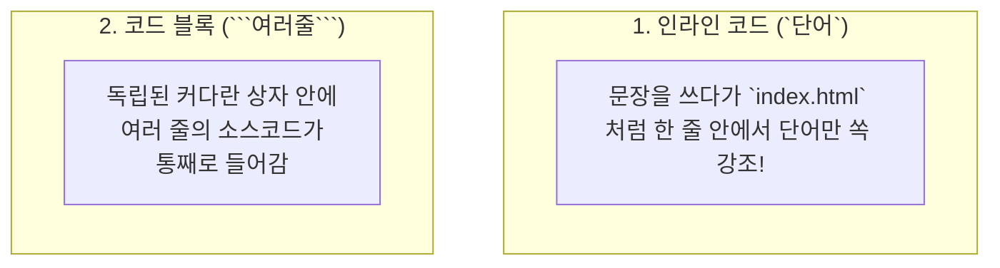

# 📚 [Wiki] 인라인 코드 (Inline Code)

> 🔙 **[돌아가기: 0-2. 마크다운_문법(참고).md](../0-2.%20마크다운_문법(참고).md)**

---

### ☕ 1분 비유: "문장 속에 붙이는 작고 네모난 이름표"

우리가 글을 쓰다가 **"이 단어는 컴퓨터 명령어예요!"** 또는 **"이건 파일 이름이에요!"**라고 알려주고 싶을 때가 있습니다.

- **일반 글씨**: 평범한 일상 대화 문장
- **인라인 코드**: 문장 한가운데에 **작은 회색 스티커(이름표)**를 찰칵 붙여서 *"이건 특별한 단어니까 주목해!"* 하고 눈에 띄게 감싸주는 포장지

```text
일반 글: 터미널에 git push를 입력하세요. (어디까지가 명령어인지 헷갈림)
인라인:  터미널에 `git push`를 입력하세요. (회색 박스로 감싸져서 명령어가 쏙 눈에 띔!)
```

---

### 🔍 '인라인(Inline)'이란 무슨 뜻인가요?

영어 단어를 쪼개보면 아주 직관적입니다:
- **In** (~의 안에) + **Line** (문장의 한 줄)
- 즉, **"새로운 줄로 넘어가지 않고, 현재 문장 줄 안에(In-line) 자연스럽게 쏙 들어간다"**는 뜻입니다.

---

### 🏗️ 핵심 그림: 코드 블록과의 차이점



---

### 🆚 '인라인 코드' vs '코드 블록' 한눈에 비교

| 구분 | 🏷️ 인라인 코드 (Inline Code) | 📦 코드 블록 (Code Block) |
| :--- | :--- | :--- |
| **작성 기호** | 백틱 1개 (`` `코드` ``) | 백틱 3개 (```` ```코드``` ````) |
| **줄바꿈** | **줄바꿈 없음** (문장 중간에 자연스럽게 삽입) | **줄바꿈 있음** (위아래로 독립된 네모 상자 생성) |
| **주요 용도** | 파일명, 단축키, 명령어 1개, 변수명 | 5~10줄 이상의 실제 프로그램 전체 소스코드 |
| **실제 모양** | 예: `app.js` 파일을 열어주세요. | 아래처럼 큰 회색 상자로 표시됨 |

---

### ⌨️ 백틱( \` ) 기호는 키보드 어디에 있나요?

인라인 코드를 감싸는 기호는 작은따옴표(`'`)가 아니라 **백틱(Backtick, \` )**입니다!

- **위치**: 키보드 맨 왼쪽 위, **`Esc` 키 바로 아래 / 숫자 `1`번 키 바로 왼쪽**에 있습니다.
- **입력 방법**: 영문 상태에서 `Shift`를 누르지 않고 그냥 톡 누르면 **`** 기호가 찍힙니다. (Shift를 누르면 물결표 `~`가 나옵니다.)

---

### 💡 실무에서 언제 가장 많이 쓰나요? (활용 예시 3가지)

1. **파일 이름이나 폴더 경로를 부를 때**:
   - ✍️ 작성: 프로젝트 폴더의 \`index.html\` 파일을 브라우저로 엽니다.
   - 📊 결과: 프로젝트 폴더의 `index.html` 파일을 브라우저로 엽니다.

2. **키보드 단축키나 프로그램을 알려줄 때**:
   - ✍️ 작성: 코드를 저장할 때는 \`Ctrl + S\`를 누르세요.
   - 📊 결과: 코드를 저장할 때는 `Ctrl + S`를 누르세요.

3. **터미널 명령어 한 단어를 짚어줄 때**:
   - ✍️ 작성: 변경 사항을 깃허브에 올리려면 \`git push\`를 실행합니다.
   - 📊 결과: 변경 사항을 깃허브에 올리려면 `git push`를 실행합니다.

---

> 💡 **한 줄 정리**: 문장을 읽는 흐름을 끊지 않으면서, 파일명이나 명령어 같은 **특별한 단어 하나만 예쁘게 네모 상자로 강조하고 싶을 때 쓰는 문법**입니다!
